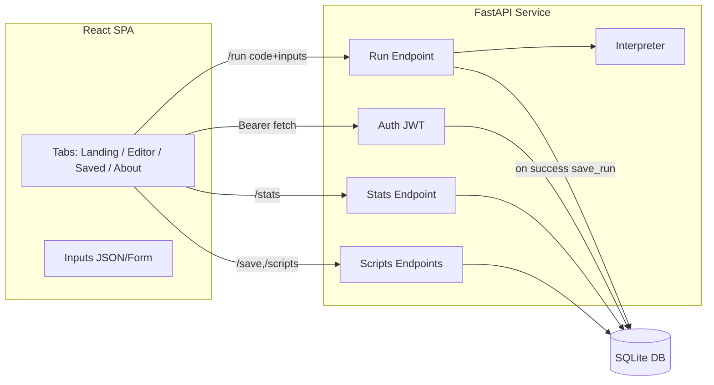

# EcoLang — High-Level Design (HLD)

This document describes the architecture of the EcoLang application: a web-based playground to write and run EcoLang programs, estimate eco impact, and manage scripts with user authentication.

## Project overview and context

### Brief overview of the project

EcoLang is a web-based learning platform and sandbox for a tiny teaching language focused on two goals: (1) making programming concepts approachable, and (2) increasing awareness of the environmental cost of computation. Learners write EcoLang programs in a browser editor and run them against a safe, server-side interpreter. Each run returns output, warnings, and estimated eco metrics (operations, energy, and CO₂), helping users connect coding decisions to resource use.

The platform consists of a React + Vite single-page app (SPA) and a FastAPI backend. The backend exposes endpoints for authentication, executing code, saving/opening scripts, and viewing run stats, backed by a lightweight SQLite database. The interpreter is in-process, deterministic, and sandboxed via an AST whitelist and strict per-run limits.

### Problem statement

- Beginners often struggle with heavy toolchains and complex languages when first learning programming, leading to slow feedback loops and confusion.
- Running user-provided code in a browser or server raises safety and resource concerns (security, runaway loops, large outputs).
- Most learning environments do not expose the real-world cost of computation (energy, CO₂), missing an opportunity to teach efficient, responsible coding habits.
- Educators need a simple, safe, and shareable environment to demonstrate fundamentals and compare alternative solutions’ efficiency.

### Objective and purpose of the platform

- Provide a minimal, friendly language with immediate feedback to teach programming basics (variables, expressions, conditionals, loops, functions, arrays, inputs).
- Offer a safe, budgeted execution environment that prevents abuse (time/step/output caps, AST whitelist), suitable for classrooms and open sharing.
- Expose eco metrics (estimated operations, energy, CO₂) per run so learners can connect code structure to environmental impact and learn greener patterns.
- Enable persistence (auth + saved scripts + history) so users can iterate, compare runs, and build a personal library of examples.

### Key features and innovations

- Safe, deterministic interpreter with strict limits: AST whitelist, step/time/output caps, and bounded loop counts; per-run fresh state.
- Eco metrics built-in: operation accounting with derived energy (J/kWh) and CO₂ estimates, plus context-sensitive tips; `savePower N` knob to simulate lower-power modes.
- Simple but expressive language surface: `say/let/const/warn/ask/if/elif/else/repeat/while/for/func/return/call`, plus helpers like `len/length`, `toNumber`, `toString`, `array`, `append`, `at`, `ecoOps`.
- Interactive tutorial (About tab) with runnable, copy-paste examples and “Use as inputs” integration; editor supports JSON/Form inputs.
- Lightweight architecture and storage: FastAPI + SQLite with JWT auth; easy local setup (Uvicorn + Vite) and straightforward cloud deployment.
- Dev/productivity touches: SPA remembers token/theme/API base/inputs mode; scripts and run history per user; clear structured error messages.

### Target audience

- Students and self-learners seeking a low-friction introduction to programming concepts.
- Educators and facilitators who need a safe, demo-friendly environment for teaching and workshops.
- Developers and sustainability advocates exploring the relationship between code structure and resource usage.
- Hackathon and community groups wanting a lightweight, shareable sandbox to prototype and compare ideas.

## Brief architecture description

- Style: client–server, stateless REST API, single-page application (SPA) frontend.
- Frontend: React + Vite SPA. Tabs for Landing (auth), Editor (code, inputs Form/JSON), Saved Scripts, and About (interactive tutorial). Uses localStorage for token/theme/API base/inputs mode.
- Backend: FastAPI service with endpoints for auth, run, save, scripts, and stats. Each /run constructs a fresh Interpreter with server-side safety caps. Data stored in SQLite via thin DB helpers.
- Interpreter: In-process, safe, budgeted interpreter with AST whitelisting and loop/time/output limits. Accounts operations to estimate energy and CO₂; supports say/let/ask/warn/if/elif/else/repeat/func/call/while/for.
- Persistence: SQLite with three tables (Users, Scripts, Runs). JWT for user scoping. CORS permissive in development.

## Functional requirements → architectural components

- Execute EcoLang code and return output/errors/warnings/eco
  - Component(s): FastAPI `/run`, Interpreter (`backend/ecolang/interpreter.py`).
- Provide user inputs to programs (`ask`)
  - Component(s): Frontend Inputs (Form/JSON), `/run` request body `inputs`.
- Estimate eco impact (ops, Joules, kWh, CO₂, tips) per run
  - Component(s): Interpreter eco accounting and `_compute_eco`, surfaced by `/run`.
- Authenticate users and scope data per user
  - Component(s): `/auth/register`, `/auth/login` (JWT), `get_current_user_id`, DB Users table.
- Save, list, and open scripts; view run history
  - Component(s): `/save`, `/scripts`, `/scripts/{id}`, `/stats`, DB Scripts/Runs tables, frontend Saved Scripts and history table.
- Learn EcoLang via an interactive tutorial
  - Component(s): Frontend About tab with markdown-to-JSX renderer and “Try it”/“Use as inputs”.

## Component to architecture design (responsibilities)

- Frontend (React SPA)
  - Tabs: Landing (auth form), Editor (code + Inputs tabs: JSON/Form), Saved Scripts, About.
  - Data flow: Fetch calls to API; Bearer token attached when present; localStorage for token/theme/API base/inputs mode.
  - Inputs editor: two-way sync between JSON textarea and a typed key–value Form (string, number, boolean, null, array, object).
  - Tutorial renderer: fenced-code/heading/list/paragraphs; injects code/inputs into the editor.

- API Layer (FastAPI)
  - Auth: bcrypt password hashing; JWT (HS256) creation/verification.
  - Run: validates and caps tunables server-side; builds a fresh Interpreter per request; persists run stats on success.
  - Scripts & Stats: CRUD-lite for scripts; list run history. All user-scoped via JWT.
  - CORS: permissive for dev; restrict in prod.

- Interpreter (Core)
  - Safety: AST whitelist, per-run limits (max_steps, max_loop, max_time_s, max_output_chars); call depth limits.
  - Language: say/let/const/warn/ask/if/elif/else/repeat/func/return/call/while/for.
  - Execution: main loop dispatch; nested blocks extracted and executed; while/for execute blocks inline to persist env mutations.
  - Accounting: ops map and eco estimation (energy_per_op_J, idle_power_W, co2_per_kwh_g) → total_ops, Joules, kWh, CO₂, tips.

- Data Access (SQLite via `backend/db.py`)
  - Tables: Users(username, password_hash), Scripts(user_id, title, code_text), Runs(script_id, energy_J, energy_kWh, co2_g, total_ops, duration_ms, tips JSON).
  - Functions: init_db, create_user, get_user_by_username, save_script, list_scripts, get_script, save_run, list_runs.
  - One connection per call; acceptable for current load.

## Diagrammatic representation of architecture



ASCII (fallback):

```text
[React SPA] --Bearer--> [FastAPI]
  | /run (code, inputs)         |-> [Interpreter] -> result (output, warnings, eco)
  | /auth (register/login)      |-> [JWT] -> [SQLite.Users]
  | /save,/scripts,/stats       |-> [SQLite.Scripts/Runs]
```

## Non-functional requirements and architectural support

- Security
  - JWT Bearer auth; bcrypt password hashing; user scoping on script/stat endpoints; safe expression AST whitelist; no dynamic eval.
  - Server-side capping of runtime tunables prevents clients from disabling safety limits.
- Reliability & Safety
  - Per-request fresh Interpreter prevents cross-user state leakage; strict time/step/output limits; structured error reporting.
- Performance
  - Lightweight in-process interpreter; simple synchronous FastAPI handlers; O(1) accounting per step.
  - SQLite is sufficient for current concurrency; low-latency single-machine dev.
- Maintainability
  - Clear separation: API ↔ Interpreter ↔ DB; small, focused modules; Pydantic request models.
- Observability
  - Deterministic outputs and eco metrics; warnings aggregated; easy to add logging at API/interpreter boundaries.
- Portability/Dev Experience
  - Local setup with Vite and Uvicorn; permissive CORS in dev; single-file SQLite DB.

## Pros and cons of the architecture

Pros

- Simple, readable codebase; fast local setup (SQLite, Vite, Uvicorn).
- Strong runtime safety for untrusted code: AST whitelist + strict limits.
- Clear separation of concerns; easy to extend language features (e.g., while/for integrated).
- Per-user scoping with JWT; minimal overhead.

Cons / Limitations

- SQLite single-writer limits and lack of pooling may bottleneck under heavy concurrent writes.
- In-process interpreter ties execution to API process; horizontal scaling of long/larger runs would need more isolation.
- Permissive CORS is dev-friendly but must be hardened for production.
- No built-in rate limiting, audit logging, or multi-node session management yet.

## Future evolution (optional)

- Swap SQLite for Postgres and add a connection pool for higher concurrency.
- Add rate limiting and structured logging/metrics.
- Sandbox heavy/long executions via a worker process or job queue.
- Harden security (strict CORS, secret management, HTTPS, password rules).
- Expand interpreter (break/continue, additional safe helpers, profiling hooks).

