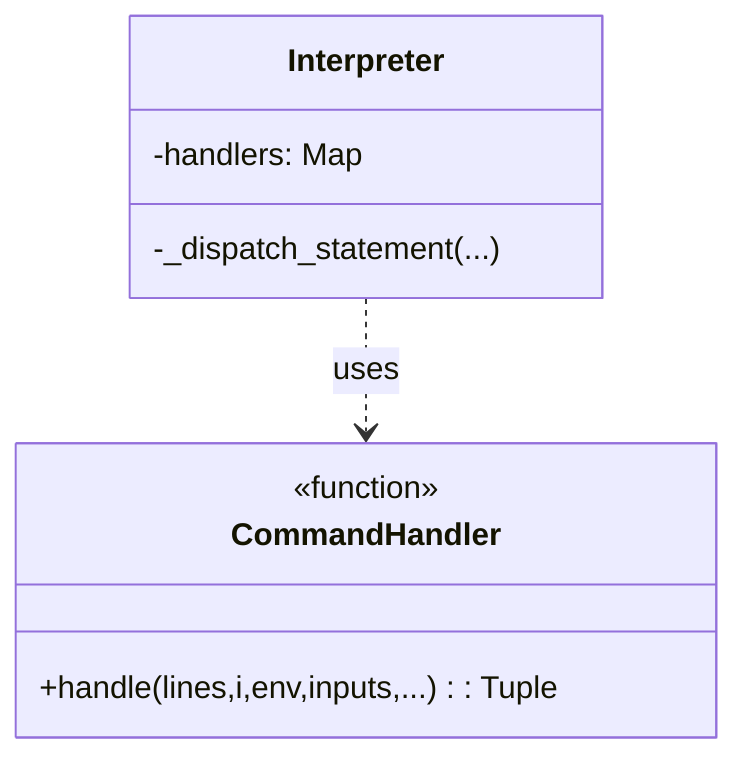
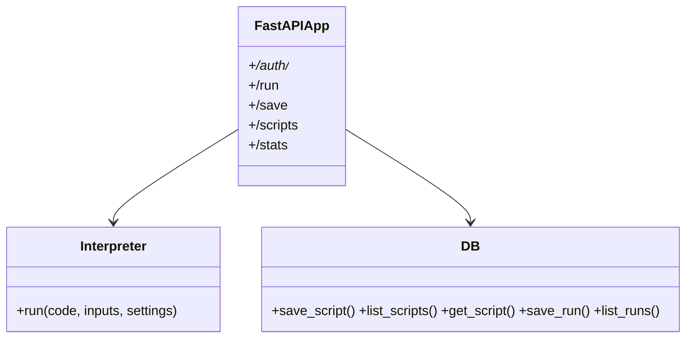
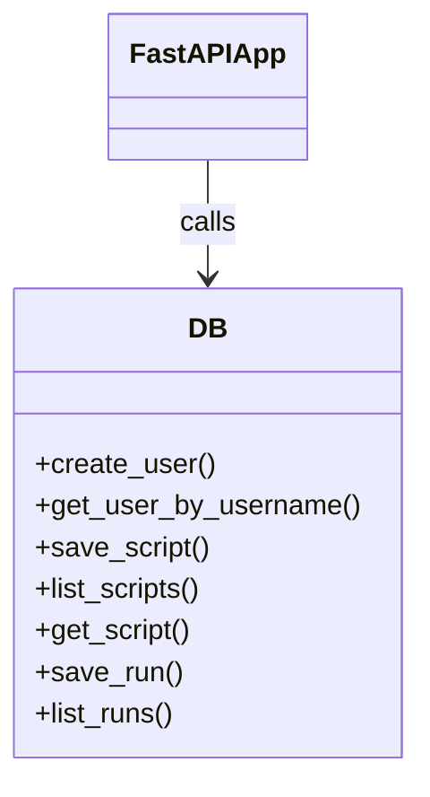
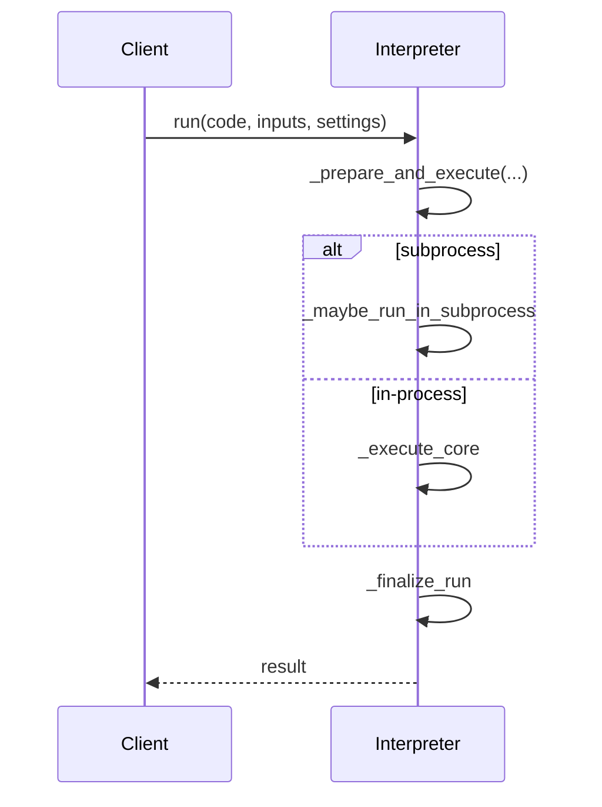
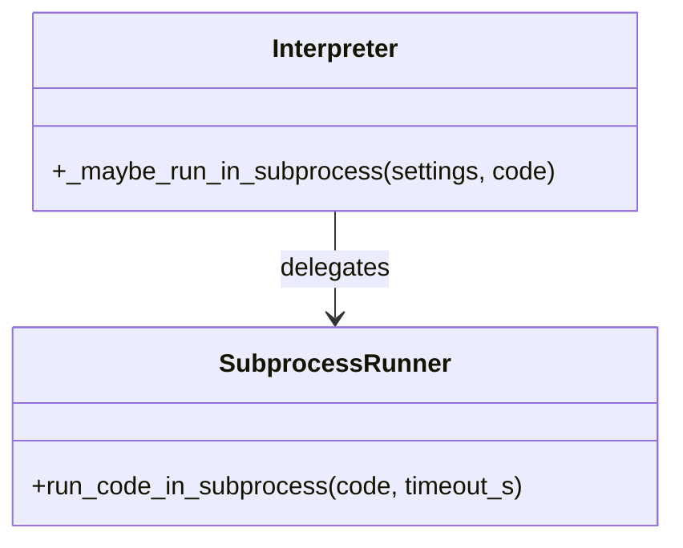
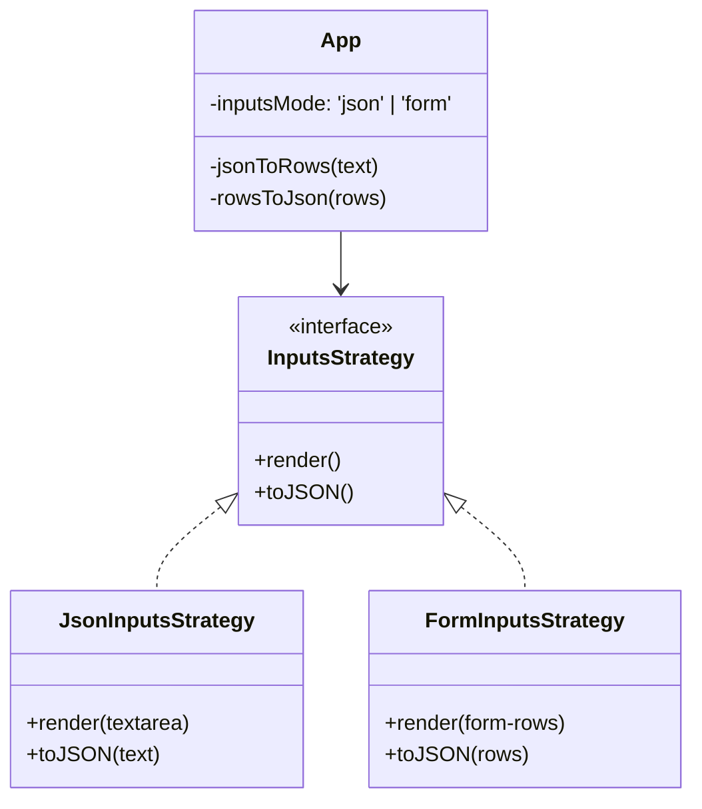

# EcoLang — Design Patterns and Principles

This document identifies key design patterns used in the EcoLang system, provides diagrammatic representations, and shows code snippets from this repository that implement each pattern. It also lists the design principles applied and why they were chosen.

## Design Patterns

We highlight at least four patterns with diagrams and code snippets:

- Command
- Facade
- Repository
- Template Method
- Proxy (additional)

### 1) Command Pattern (statement dispatch in Interpreter)

Intent: Encapsulate each language statement (say, let, warn, ask, if, repeat, while, for, func, call) as a handler “command” and route via a small dispatch map instead of a large conditional chain.

Diagram:



Code snippet (from `backend/ecolang/interpreter.py`):

```python
# inside _dispatch_statement
dispatch_map = {
    "say": lambda: self._dispatch_simple_prefix(
        line, i, env, ops_scale
    ),
    "let": lambda: self._dispatch_simple_prefix(
        line, i, env, ops_scale
    ),
    "const": lambda: self._dispatch_const(line, i, env, ops_scale),
    "warn": lambda: self._dispatch_simple_prefix(
        line, i, env, ops_scale
    ),
    "ask": lambda: self._dispatch_ask(
        line, i, env, inputs, ops_scale
    ),
    "func": lambda: self._dispatch_func_def(lines, i),
    "call": lambda: self._dispatch_func_call(line, i, env, inputs, ops_scale),
    "if": lambda: self._dispatch_control_if(
        lines, i, env, inputs, output_lines, warnings, total_ops, ops_scale
    ),
    "repeat": lambda: self._dispatch_control_repeat(
        lines, i, env, inputs, output_lines, warnings, total_ops, ops_scale
    ),
    "while": lambda: self._dispatch_control_while(
        lines, i, env, inputs, output_lines, warnings, total_ops, ops_scale
    ),
    "for": lambda: self._dispatch_control_for(
        lines, i, env, inputs, output_lines, warnings, total_ops, ops_scale
    ),
}
handler = dispatch_map.get(token)
```

Why it helps

- Extensible: add a statement by registering an entry and its handler.
- Minimizes branching and keeps handlers cohesive.

### 2) Facade Pattern (API as a simple front for core services)

Intent: The FastAPI layer provides a simple facade over the interpreter and persistence concerns, shielding clients from internal complexity and enforcing server-side caps.

Diagram:



Code snippet (from `backend/app/main.py`):

```python
@app.post("/run")
async def run_code(req: RunRequest):
    capped = _cap_settings(req.settings or {})
    it = Interpreter()
    it.max_steps = capped.get("max_steps", it.max_steps)
    it.max_loop = capped.get("max_loop", it.max_loop)
    it.max_time_s = capped.get("max_time_s", it.max_time_s)
    it.max_output_chars = capped.get("max_output_chars", it.max_output_chars)
    result = it.run(req.code, inputs=req.inputs or {}, settings=capped)
    # persist eco stats (non-fatal)
    if result.get('errors') is None and result.get('eco'):
        eco = result['eco']
        db.save_run(
            req.script_id,
            eco.get("energy_J"), eco.get("energy_kWh"), eco.get("co2_g"),
            eco.get("total_ops"), result.get("duration_ms"), eco.get("tips")
        )
    return result
```

Why it helps

- A clean, stable interface for the frontend.
- Centralizes cross-cutting concerns (capping, persistence, error shaping).

### 3) Repository Pattern (thin DB access layer)

Intent: Encapsulate SQL and persistence details behind simple functions to keep application logic free of storage concerns.

Diagram:



Code snippet (from `backend/db.py`):

```python
def get_user_by_username(username: str) -> Optional[Dict[str, Any]]:
    conn = get_conn()
    cur = conn.cursor()
    cur.execute('SELECT user_id, username, password_hash, created_at FROM Users WHERE username = ?', (username,))
    row = cur.fetchone()
    conn.close()
    return dict(row) if row else None

def save_script(title: str, code_text: str, user_id: Optional[int] = None, eco_stats: Optional[Dict[str, Any]] = None) -> int:
    conn = get_conn()
    cur = conn.cursor()
    cur.execute('INSERT INTO Scripts (user_id, title, code_text) VALUES (?, ?, ?)', (user_id, title, code_text))
    script_id = cur.lastrowid
    conn.commit()
    conn.close()
    if eco_stats:
        save_run(script_id, eco_stats.get("energy_J"), eco_stats.get("energy_kWh"), eco_stats.get("co2_g"), eco_stats.get("total_ops"), eco_stats.get("duration_ms"), eco_stats.get("tips"))
    return script_id
```

Why it helps

- Keeps SQL in one place, simplifying testing and future migration to Postgres.
- Simplifies endpoint handlers.

### 4) Template Method Pattern (run flow skeleton)

Intent: Define the algorithm skeleton in `run` and `_prepare_and_execute`, deferring steps like subprocess fast-path and the core executor to dedicated methods.

Diagram:



Code snippet (from `backend/ecolang/interpreter.py`):

```python
def run(self, code, inputs=None, settings=None) -> Dict[str, Any]:
    output_lines, warnings, total_ops, maybe_err, start_time = self._prepare_and_execute(code, inputs, settings)
    if maybe_err.get("errors"):
        return {"output": "\n".join(output_lines), "warnings": warnings, "eco": None, "errors": maybe_err["errors"]}
    return self._finalize_run(output_lines, warnings, total_ops, start_time)

def _prepare_and_execute(self, code, inputs, settings):
    inputs_local = inputs or {}
    settings_local = settings or {}
    if settings_local.get("use_subprocess"):
        res = self._maybe_run_in_subprocess(settings_local, code)
        return (res.get("output", "").splitlines(), res.get("warnings", []), 0, res.get("errors") or {}, time.time())
    return self._execute_core(code, inputs_local, settings_local)
```

Why it helps

- Clear separation of concerns and easier testing of each step.
- Easy to add new execution modes (e.g., remote worker) without changing `run`.

### 5) Proxy Pattern (subprocess runner)

Intent: The interpreter can delegate execution to a sandboxed subprocess; `_maybe_run_in_subprocess` acts as a protective proxy that standardizes results and isolates failures.

Diagram:



Code snippet (from `backend/ecolang/interpreter.py`):

```python
def _maybe_run_in_subprocess(self, settings: Dict[str, Any], code: str):
    try:
        rc, out, err = subprocess_runner.run_code_in_subprocess(code, timeout_s=int(settings.get("timeout_s", 2)))
    except Exception as e:
        return {"output": "", "warnings": [], "eco": None, "errors": {"code": "SUBPROCESS_ERROR", "message": str(e)}}
    if rc != 0:
        return {"output": out, "warnings": [], "eco": None, "errors": {"code": "SUBPROCESS_FAILED", "message": err}}
    try:
        payload = json.loads(out)
        return {"output": str(payload.get("result")), "warnings": [], "eco": None, "errors": payload.get("error")}
    except Exception:
        return {"output": out, "warnings": [], "eco": None, "errors": None}
```

Why it helps

- Safety and isolation for potentially expensive or unsafe executions.
- A unified response shape regardless of execution location.

## Frontend Patterns

### Strategy Pattern — Inputs editor (JSON/Form)

Intent: Allow switching between multiple input editing strategies (JSON textarea vs. structured Form) at runtime while keeping the rest of the editor logic unchanged.

Diagram:



Code snippet (from `frontend/src/App.jsx`):

```jsx
const [inputsMode, setInputsMode] = useState(() => localStorage.getItem('inputsMode') || 'json')
const [inputsText, setInputsText] = useState('{"answer":"yes"}')
const [formRows, setFormRows] = useState([])

function jsonToRows(text) {
  try {
    const obj = JSON.parse(text || '{}')
    if (!obj || typeof obj !== 'object' || Array.isArray(obj)) return []
    return Object.entries(obj).map(([k, v]) => {
      if (v === null) return { key: k, type: 'null', value: '' }
      if (Array.isArray(v)) return { key: k, type: 'array', value: JSON.stringify(v) }
      switch (typeof v) {
        case 'boolean': return { key: k, type: 'boolean', value: String(v) }
        case 'number': return { key: k, type: 'number', value: String(v) }
        case 'object': return { key: k, type: 'object', value: JSON.stringify(v) }
        default: return { key: k, type: 'string', value: String(v) }
      }
    })
  } catch { return [] }
}

function rowsToJson(rows) {
  const obj = {}
  for (const r of rows) {
    const k = (r.key || '').trim()
    if (!k) continue
    const t = r.type || 'string'
    const v = r.value
    try {
      if (t === 'string') obj[k] = String(v ?? '')
      else if (t === 'number') {
        const n = Number(v); if (!Number.isFinite(n)) throw new Error('Invalid number'); obj[k] = n
      } else if (t === 'boolean') {
        obj[k] = String(v).toLowerCase() === 'true'
      } else if (t === 'null') {
        obj[k] = null
      } else if (t === 'array' || t === 'object') {
        obj[k] = JSON.parse(v || (t === 'array' ? '[]' : '{}'))
      } else { obj[k] = v }
    } catch { /* skip invalid entries */ }
  }
  return JSON.stringify(obj)
}

// Switch strategies
<div className="inputs-tabs" role="tablist">
  <button role="tab" aria-selected={inputsMode==='json'} className={inputsMode==='json'?'active':''} onClick={()=>setInputsMode('json')}>JSON</button>
  <button role="tab" aria-selected={inputsMode==='form'} className={inputsMode==='form'?'active':''} onClick={()=>setInputsMode('form')}>Form</button>
</div>
{inputsMode === 'json' ? (
  <textarea className="inputs" value={inputsText} onChange={e => setInputsText(e.target.value)} spellCheck={false} />
) : (
  <div className="inputs-form">{/* renders formRows and keeps inputsText in sync via rowsToJson */}</div>
)}
```

Why it helps

- Swappable editing modes with the same JSON output contract.
- Enables future strategies (e.g., CSV import) without changing consumers.

### Container/Presenter (Smart/Dumb) — App vs. Panels

Intent: Separate stateful data fetching, orchestration, and side-effects (Container) from mostly stateless rendering (Presenter) to keep UI components simple and reusable.

Diagram:

```mermaid
classDiagram
  class App(Container) {
    +state: code, inputsText, outputs, stats, token, apiBase
    +effects: loadScripts(), runCode(), saveScript(), fetchStats(), doAuth()
  }
  class EditorPanel(Presenter)
  class ScriptsPanel(Presenter)
  class AboutPanel(Presenter)
  App --> EditorPanel
  App --> ScriptsPanel
  App --> AboutPanel
```

Code snippet (from `frontend/src/App.jsx`):

```jsx
// Container concerns: owns state and effects
const [scripts, setScripts] = useState([])
async function loadScripts() {
  const r = await fetch(`${apiBase}/scripts`, { headers: token ? { 'Authorization': `Bearer ${token}` } : {} })
  setScripts(await r.json())
}
async function runCode() {
  const resp = await fetch(`${apiBase}/run`, { method: 'POST', headers: { 'Content-Type': 'application/json' }, body: JSON.stringify({ code, inputs: inputsObj, ...(currentScriptId?{script_id:currentScriptId}:{}) }) })
  const j = await resp.json().catch(()=>({}))
  setOutput(j.output || ''); setWarnings(j.warnings||[]); setEco(j.eco||null); setError(j.errors||null)
}

// Presenter usage: UI panels are mostly stateless and receive data via props/state
{isAuthed && showEditor === 'editor' && (
  <div className="panel">
    <div className="editor-grid">{/* inputs, code, controls, output */}</div>
  </div>
)}
{tab === 'scripts' && (
  <div className="panel">{/* scripts list + run history table */}</div>
)}
{tab === 'about' && (
  <div className="panel">{renderTutorial(tutoMd, { onTryCode: (src)=>{ setCode(src); setTab('editor') }, onTryInputs: (json)=>{ setInputsText(json); setInputsMode('json'); setTab('editor') } })}</div>
)}
```

Why it helps

- Keeps rendering simple; logic stays centralized in one container.
- Easier to test business logic separately from presentational markup.

## Design Principles (table)

| Principle | Where used | Reason/Benefit |
|---|---|---|
| Single Responsibility (SRP) | `backend/app/main.py` endpoints; `backend/ecolang/interpreter.py` runtime; `backend/db.py` persistence | Each module owns one concern (API, execution, persistence), simplifying maintenance and testing. |
| Open/Closed (OCP) | Interpreter dispatch map; adding new statements | Add new statement handlers by extension (register in `dispatch_map`) without modifying existing handlers’ internals. |
| Liskov Substitution (LSP) | `SafeEvaluator` leverages `ast.NodeVisitor` contract | Honors visitor contracts; safe to substitute with compatible visitor implementations. |
| Interface Segregation (ISP) | Thin DB helper functions | Callers import and use only the functions they need; avoids monolithic interfaces. |
| Dependency Inversion (DIP) | API depends on `db` helpers and `Interpreter` abstractions | High-level API logic depends on simple abstractions, not concrete SQL queries or execution internals. |
| Principle of Least Privilege | AST whitelist; server-side caps in `_cap_settings` | Minimizes attack surface and resource misuse by restricting features and capping runtime. |
| Separation of Concerns | SPA ↔ API ↔ Interpreter ↔ DB boundaries | Clear layers improve readability and enable independent evolution and testing. |
| DRY & KISS | Centralized eco computation; shared error shaping | Avoids duplication and keeps logic simple and explicit for reliability. |

Notes

- For production, harden CORS, secrets, and add rate limiting; these align with Security by Design.

## Next patterns (future improvements)

- Observer: Keyboard shortcuts already use an event subscription pattern via `window.addEventListener('keydown', onKey)` in `App.jsx`. We can extract a tiny EventBus or hook (e.g., `useShortcut`) to formalize observers and allow multiple components to subscribe/unsubscribe cleanly.
- Command: Tutorial actions (“Try it”, “Use as inputs”) are bound to button callbacks (`onTryCode`, `onTryInputs`). We can encapsulate these as command objects (execute/undo) to enable history, telemetry, and easier testing of user actions.
