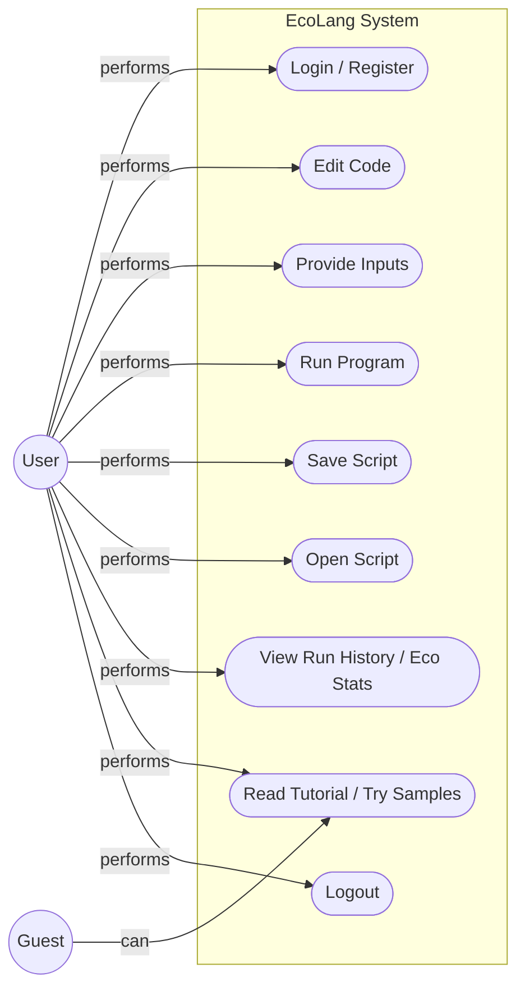
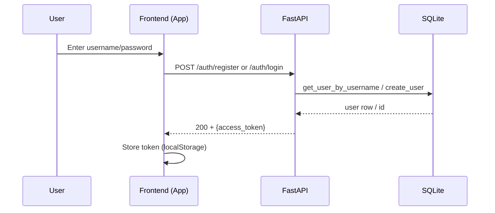
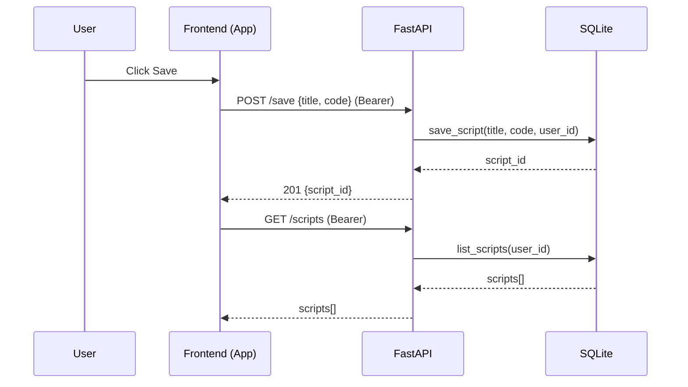
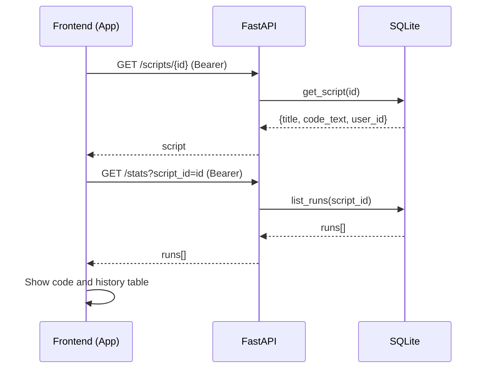
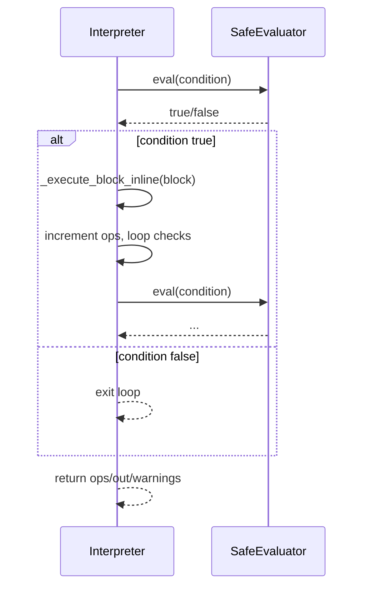
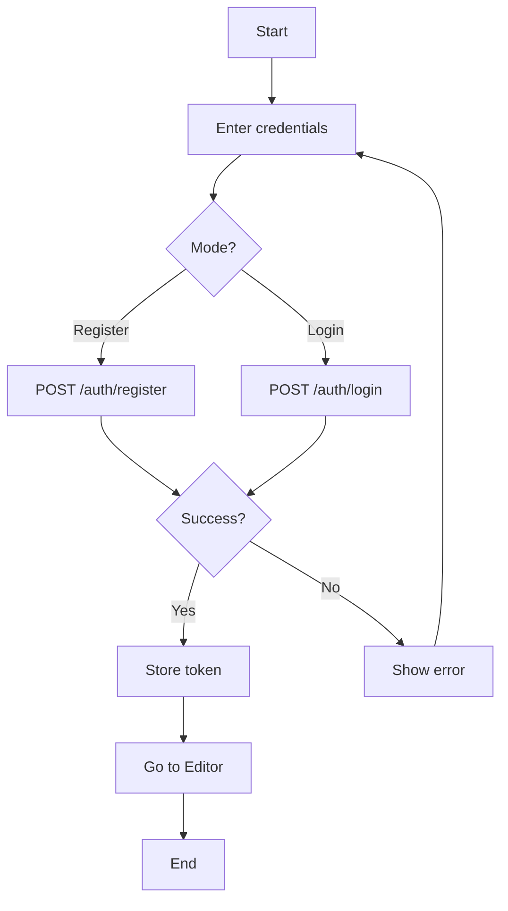
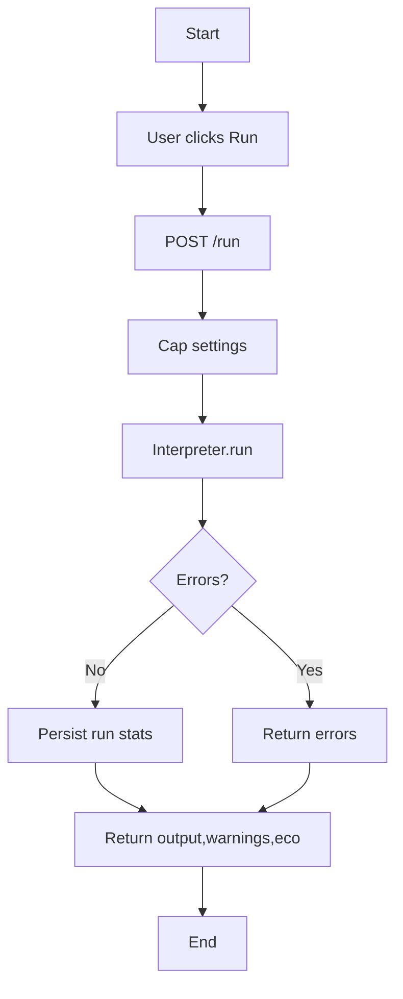
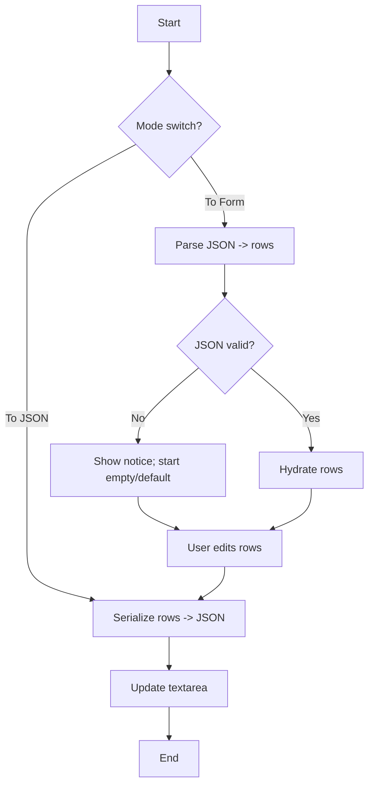
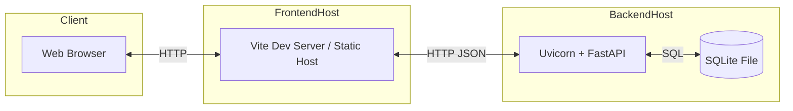

# EcoLang — Low-Level Design (LLD) UML Diagrams

This document provides UML-style diagrams (via Mermaid) for the EcoLang system.

## Use Case Diagram



## Class Diagram

```mermaid
classDiagram
	class App {
		+state: token, apiBase, theme
		+code: string
		+inputsText: string
		+runCode(): Promise
		+saveScript(): Promise
		+openScript(id): Promise
	}

	class Interpreter {
		+max_steps: int
		+max_loop: int
		+max_time_s: float
		+max_output_chars: int
		+run(code, inputs, settings) Dict
		-_dispatch_statement(...)
		-_handle_if(...)
		-_handle_repeat(...)
		-_handle_while(...)
		-_handle_for(...)
		-_execute_block_inline(...)
		-_compute_eco(total_ops, duration_s) Dict
	}

	class SafeEvaluator {
		+visit_*(astNode)
	}

	class FastAPIApp {
		+/auth/register
		+/auth/login
		+/run
		+/save
		+/scripts
		+/scripts/{id}
		+/stats
	}

	class DB {
		+init_db()
		+create_user(username, hash) int
		+get_user_by_username(username) Dict
		+save_script(title, code, user_id, eco?) int
		+get_script(id) Dict
		+list_scripts(user_id?) List
		+save_run(script_id, energy_J, energy_kWh, co2_g, total_ops, duration_ms, tips) int
		+list_runs(script_id?) List
	}

	class Models {
		<<Pydantic>>
		RunRequest
		SaveScriptRequest
		TokenOut
	}

	App --> FastAPIApp : fetch()
	FastAPIApp ..> Models
	FastAPIApp --> Interpreter : per-request run
	FastAPIApp --> DB : CRUD
	Interpreter --> SafeEvaluator : uses
```

## Sequence Diagrams (5)

### 1) User Registration/Login



### 2) Run Code with Inputs

```mermaid
sequenceDiagram
	participant U as User
	participant FE as Frontend (App)
	participant API as FastAPI
	participant INT as Interpreter
	participant DB as SQLite
	U->>FE: Click Run
	FE->>API: POST /run {code, inputs}
	API->>API: _cap_settings()
	API->>INT: new Interpreter(); run(...)
	INT->>INT: parse/dispatch; evaluate; account ops
	INT-->>API: result {output, warnings, eco}
	API->>DB: save_run(script_id?, eco, duration_ms)
	DB-->>API: run_id
	API-->>FE: 200 {output, warnings, eco, duration_ms}
	FE->>FE: Render Output/Eco/Warnings
```

### 3) Save Script



### 4) Open Script and View Stats



### 5) Interpreter While-Loop Execution (internal)



## Activity Diagrams (3)

### A) Login Flow



### B) Run Execution Flow



### C) Inputs Editor Sync (JSON ↔ Form)



## Deployment Diagram



